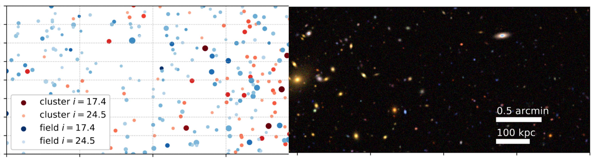

# SYNTHETIC - synthetic galaxy clusters and images, end to end.

1) Generate synthetic images of optical galaxy cluster observations.
2) Tools for reducing and processing synthetic images with metacalibration to obtain the input shear field.
3) End-to-end method validation environment for numerical methods in weak lensing measurements of galaxy clusters 

The package is aimed to be representative of the data analysis setup of the Dark Energy Science Consorcium (DESC) of the Legace Survey of Space and Time (LSST).

### Synthetic data is:
    
 * artificially generated data
 * trained to be representative of the real scenario
 * used to test and evaluate algorithms, models, and software pipelines.
 
### Scientific scope

In the domain of galaxy cluster observations our aim is to measure the weak gravitational lensing signal induced by
the gravitational potential wells of galaxy clusters, which enables us to estimate their masses. 
Validating and calibrating the weak lensing measurement is revealed to be an complex task, and the aim of this package is to 
provide the synthetic data which is then used for testing and statistical estimators and software pipelines.

Some illustrations of an earlier publication in our team is provided at the following [link](https://vargatn.github.io/synthetic/)

Please see the [DESIGN doc](DESIGN.md) file for the detailed vision 

## Features

There are three main components of this package:

**Part 1: generative galaxy cluster line of sight model**

This step is based on Varga et al 2021, and includes

* training the generative model _(heads up: high computation intensity)_ 
* drawing random realizations of a galaxy cluster as a member galaxy catalog

**Part 2: Image rendering**
* render synthetic galaxy cluster catalogs into synthetic images

**Part 3: image processing and shear estimation**
* find sources in the synthetic images
* prepare the image data and source catalog for further processing
* use the metacalibration algorithm to estimate the shear and response terms of the source catalog

## Installation

At the moment this package is installed from github, we are actively working to bring this to conda and pip

    git clone git@github.com:vargatn/synthetic.git

then install via setup.py

    python setup.pu install

**Dependencies**
To make the end-to-end data generation, rendering and metacalibration steps work there is a fair bit of external packages which need to work together

This can be quite complex to install together, so we designed the package in a compartmentalized way,
so that the different stages can be used with some dependencies missing

It is our aim to provide a working ipython kernel on the DESC machines, and locally at the USM, where the package is validated to run.

Key dependencies and versions are listed below:

**TBA**

## Getting Started
For a first time user, please start with the tutorial notebook series in the [tutorial](tutorial) folder.

## Documentation

**TBA** sphinx autodoc from docstrings 

## Contributing

In case of suggestions, please contact me at 
    
    T.Varga @ physik.lmu.de

