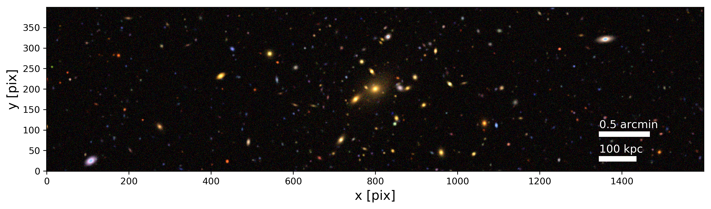
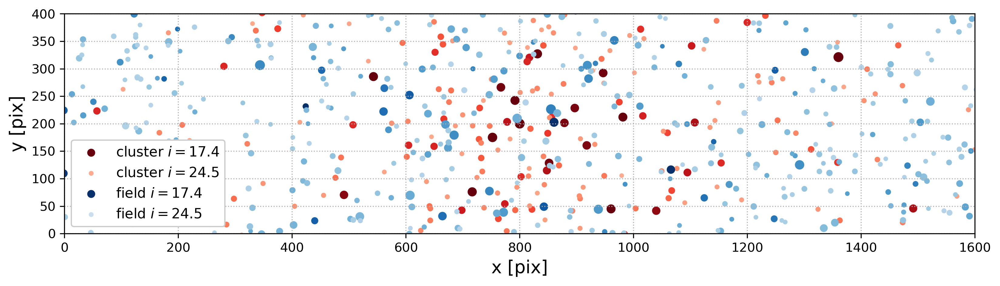
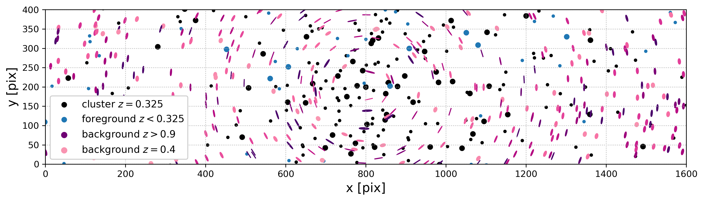

---
title: Example Gallery
layout: template
filename: example
--- 

# Example Gallery of some of the PRELIMINARY results 

These are preliminary, all rights reserved T. N.  Varga and the Dark Energy Survey.

## Can you guess which of these is real, and which is synthetic?

(does not count to scroll down ;)

One of these is a redMaPPer selected cluster, and the other is created using our statistical learning algorithm, rendered into survey-like observation from an underlying mock photometry catalog.

...

## They look quite alike!

of course the obvious bright star betrays real observations, but those are actually masked out when doing real data processing

## We simulate the underyling shear and redshift catalog too!

These images are rendered to include faint galaxies and stars too, and incorporate a photometry, shear and redshift catalog underlying each image.

