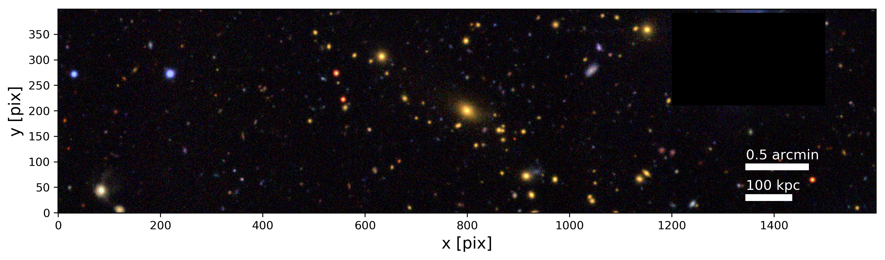
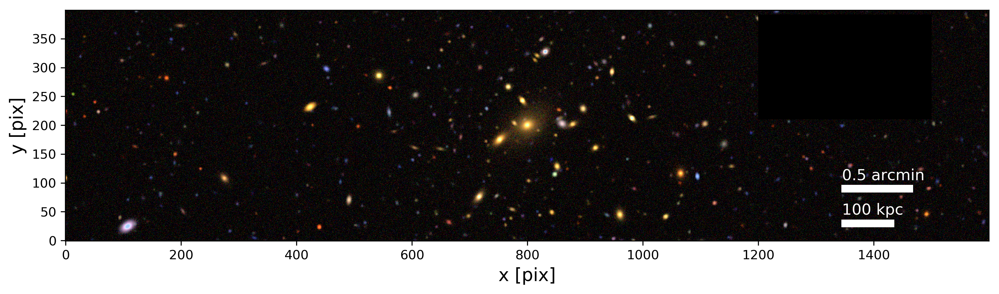

---
title: Synthetic Clusters
layout: template
filename: index
--- 

# Synthetic survey-like galaxy cluster observations

We aim to create a full synthetic testbed for **cluster weak lensing measurements**.  This will enable us to perform a full-scale mock cluster weak lensing analysis in a controlled survey-like environment.

*The detials of this work are part a pathfinder study is being prepared for publication using preliminary DES Y3 data (Varga et al in prep)*

## Can you guess which of these is real, and which is synthetic?

One of these is a redMaPPer selected cluster, and the other is created using our statistical learning algorithm, rendered into survey-like observation from an underlying mock photometry catalog.

To see the answer, check out our [Gallery](example.md)

## What's the point? 

The performance of weak lensing measurements cannot be a-priori guaranteed, it needs to be validated in a series of tests, mock
observations, and image simulations.

The interplay between different observational and systematic effects can be best characterized in a unified benchmark which tests the measurement in an
end-to-end fashion from mock observations to recovered cluster masses. Constructing such mocks which capture the key observational and physical properties of galaxy clusters is very much non-trivial. 

Galaxy clusters present a significant deviation from the cosmic median line-of-sight due the overdensity of cluster member galaxies, their diffuse intra-cluster light (ICL) and the characteristically stronger shears induced in their vicinity. These considerations pose a requirement to extend the validation of the
weak lensing estimators to cluster weak lensing scenario.

## What's the method?

Develop a statistical learning model using a data driven approach to measure the photometric properties of
galaxy clusters and their sky-environments. In this we combine information from a shallow wide area survey, and a small area deep field survey.

Creating a  mock cluster with a mock line-of-sight is formulated as a random draw from a feature distribution which enables efficient scalability for generating large numbers of mock cluster realizations required for benchmarking precision measurements.

These mock clusters and lines-of-sight are then rendered into images in the same format as actual survey observations and can further processed
with the standard data reduction and analysis pipelines of the survey.

Galaxy clusters are therefore reconstructed jointly with the line-of-sight galaxies using more precise and
accurate photometric solutions from the deep field data, and inheriting features not directly measured in the wide field, e.g. additional bands, morphology parameters or redshifts. This approach shortcuts the computational cost and limited representation of reality of numerical simulations.

## The benefits of our approach

* Ensures that synthetic observations match observed reality in terms of their galaxy populations, Does not rely on numerical simulations of baryonic structure formation and galaxy evolution to construct galaxy clusters and hence it is independent from assumptions and approximations inherent in cosmological simulations.

* New realizations of synthetic observations can be created at minimal computational cost. This allows the creation of large samples of mock
cluster images which in turn allow the precise and accurate characterization of systematic uncertainties in cluster lensing measurements.

* The used algorithm is formulated as a explicit recipe. It is *not a black box model* (such as a neural network), therefore the different components can be readily modified if need be and external information can be added in a targeted way.

## Future Outlook

A pathfinder study is currently being prepared for the Dark
Energy Survey. The algorithm is easily generalized to other upcoming surveys such as LSST and Euclid

This work hence sets the ground for a dedicated cluster image simulation analysis estimating the performance
of past and upcoming cluster mass calibration measurements.

# Contact

In case of interest or questions  please contact me at

    T.Varga [at] physik.lmu.de

